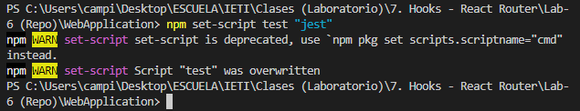

# Laboratorio 9: TDD, Jest & Enzyme - React

## Inovación y Emprendimiento con Tecnologías de Información

#### Camilo Andrés Pichimata Cárdenas

##### Agosto del 2022

## Desarrollo

Para el desarrollo de este laboratorio se trabajó sobre una nueva rama llamada [Lab_9](https://github.com/CamiloPichimata/IETI-Lab_6-Hooks-React_Router/tree/Lab_9/WebApplication) en el laboratorio 6.

Comenzamos agregando las siguientes dependencias

```bash
npm i -D jest enzyme @wojtekmaj/enzyme-adapter-react-17 @types/jest
```

En este caso se presentó un error al momento de instalar `@wojtekmaj/enzyme-adapter-react-17` debido a esto y después de consultar en diferentes fuentes se encontró y se instaló `@zarconontol/enzyme-adapter-react-18`

Seguido a esto se crea un archivo en la carpeta raiz del proyecto llamado **_setupTests.js_** el cuál contiene un adaptador de **Enzyme** para trabajar con _React_, su contenido es el siguiente

```javascript
import Enzyme from "enzyme";
import Adapter from "@zarconontol/enzyme-adapter-react-18";

Enzyme.configure({ adapter: new Adapter() });
```

Luego de esto, es necesario configurar **Jest** para que sepa en donde se ecuentra el archivo de configuración del paso anterior, ya que este se ejecutará antes de cada test existente, para esto agregamos a **_package.json_** lo siguiente:

```json
"jest": {
	"setupFilesAfterEnv": [
		"<rootDir>/setupTests.js"
	]
}
```

Creamos un test en el archivo **_App.test.js_** como el siguiente:

```javascript
import { shallow } from "enzyme";
import App from "./App";

describe("<App/>", () => {
  it("should render correctly", () => {
    const wrapper = shallow(<App />);
    expect(wrapper).toHaveLength(1);
  });
});
```

Se midifica el _scrip test_ existente ejecutando el siguiente comando:

```bash
npm set-script test "jest"
```



Ahora se instalan las siguientes dependencias de desarrollo que son útiles para admitir módulos EcmaScript en los archivos _Jest_

```bash
npm i -D @babel/preset-env babel-jest
```

Se crea un archivo llamado **_.babelrc_** en la carpeta raíz del proyecto el cuál contiene lo siguiente:

```json
{
  "presets": [
    "@babel/preset-env",
    "@babel/preset-react",
    { "runtime": "automatic" }
  ]
}
```

Se crea un archivo en el directorio raíz llamado **_styleMock.js_** este tiene como fin simular cada una de las hojas de estilo importada, este archivo contiene lo siguiente:

```
module.exports = {}
```

Ahora se mueve la configuración de _Jest_ a un archivo llamado **_jest.config.js_**, se agrega lo siguiente:

```javascript
module.exports = {
  setupFilesAfterEnv: ["<rootDir>/setupTests.js"],
  moduleNameMapper: {
    "\\.(css)$": "<rootDir>/__mocks__/styleMock.js",
  },
};
```
